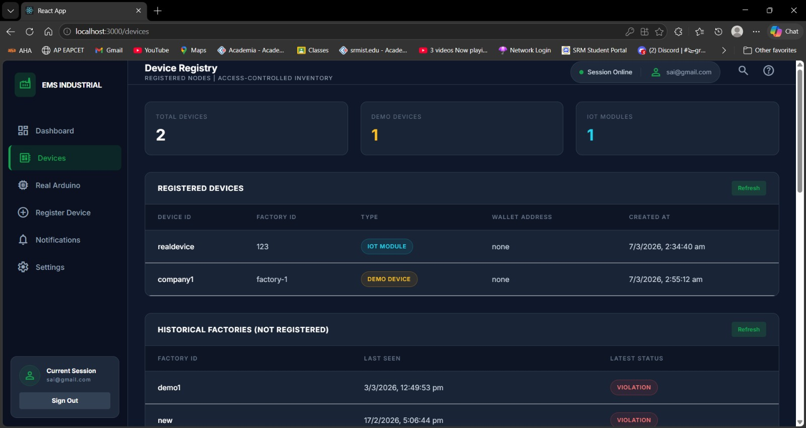
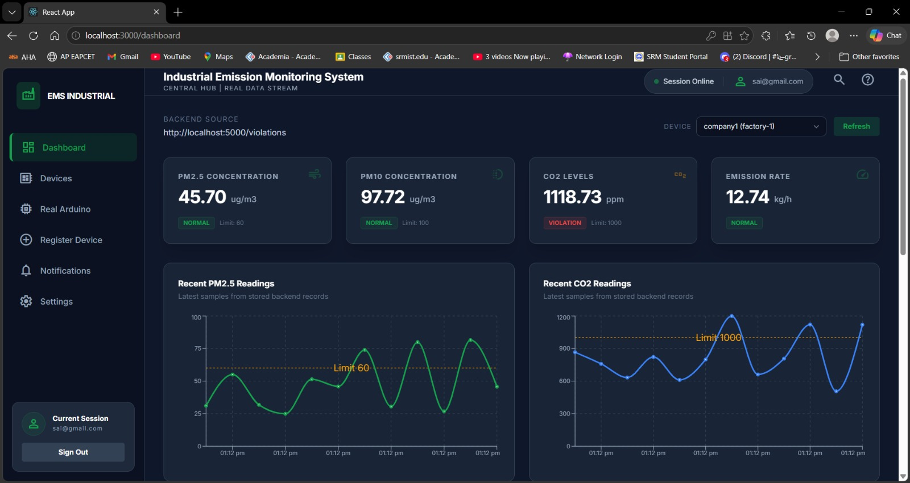
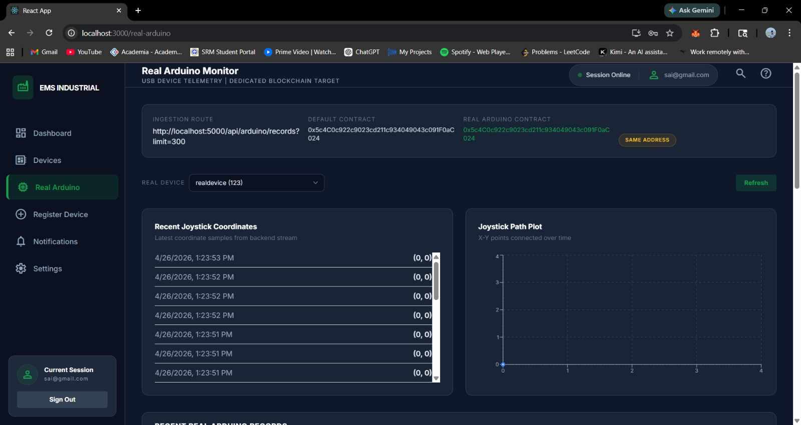
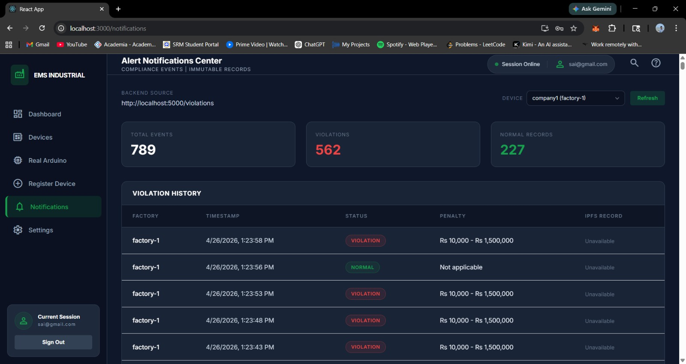

# Blockchain IoT Secure Data Exchange Project

Includes:
- Blockchain (Solidity + Truffle)
- IPFS storage
- Backend API
- IoT device simulation
- Admin dashboard
- User dashboard

Run order:
1. Ganache
2. IPFS
3. Deploy contract
4. Register device
5. Backend
6. IoT device
7. Frontend

# Blockchain IoT Monitoring System

## Dashboard Screenshots

### Device Registry

### Historical Factories

### Real Arduino Monitor

### Alert Notifications Center

